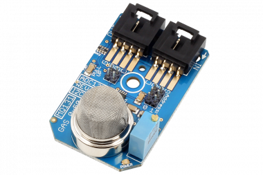

# MQ131

The MQ131 provides a high sensitivity Ozone measurement over a wide range. The NCD Mini Module pairs it with an on-board ADC making it easy to implement. This sensor requires what is known as a "burn in" time for the heating element in order to stabilize readings, the general recommended time is between 12 and 48 hours, in our tests the reading stabilized after about 36. It is also important to calibrate the sensor prior to regular usage.

The sensor pictured above can be found [here](https://store.ncd.io/product/mq-131-ozone-gas-sensor-adc121c-12-bit-adc-i%C2%B2c-mini-module/)

You can find additional information about this repository in the programming language folders.
